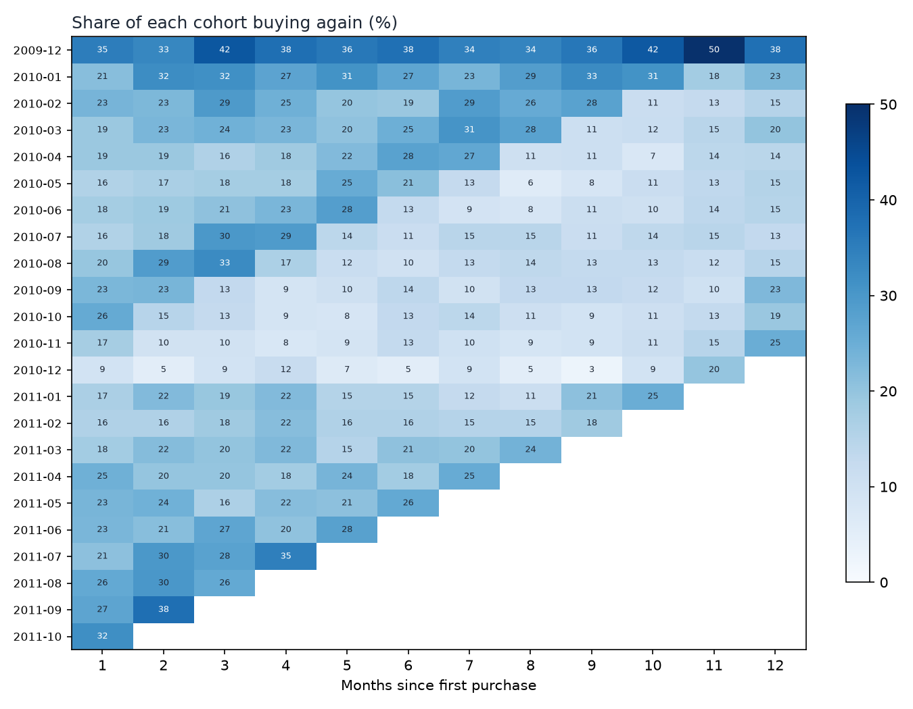

# Retail Cohort Analytics

SQL-first customer analytics on about one million real e-commerce transactions: cleaning rules, monthly revenue KPIs, cohort retention, RFM segmentation, revenue concentration, and return rates. It runs on DuckDB with pandas and matplotlib.

> **Status: learning project (September 2026).** It is built, tested, and run on the real dataset, but I am still practising explaining it. It is the first project in a data-analytics track. The dataset is real, from one UK online gift wholesaler in 2009–2011, so none of the findings generalise to retail as a whole.



## Quickstart

```bash
cd retail-cohort-analytics
python3 -m venv .venv && source .venv/bin/activate
python -m pip install -e '.[dev]'

python -m pytest -q tests                 # 13 tests, offline, hand-checkable fixtures

retail-analytics download                 # UCI archive, SHA-256 verified (~45 MB)
retail-analytics prepare                  # workbook -> parquet, removes the sheet overlap (~30 s)
retail-analytics analyze                  # every SQL analysis -> outputs/*.csv, charts, summary.json (~2 s)
```

## Headline results (run 2026-09-22)

| Question | Answer |
|---|---|
| Rows after cleaning | 1,014,944 sale lines; 5,852 identified customers; £19.70M merchandise revenue |
| How many new customers buy again the next month? | **21.0%**, cohort-size-weighted, first cohort excluded (see below) |
| ... after 3 months / 12 months? | 21.1% / 18.4% |
| How concentrated is revenue? | Top 10% of customers = **63.8%** of identified revenue; top 1% = 32.0% |
| How much merchandise is returned? | 3.65% of gross merchandise value (£719,656) |

Full tables and the reasoning behind each number are in [docs/results.md](docs/results.md). How each piece works is in [docs/how-it-works.md](docs/how-it-works.md).

## Three things the data tried to get wrong

1. **The two Excel sheets overlap.** Every line from 1–9 December 2010 appears in both. Stacking them naively double-counts 22,523 rows. `prepare` proves the two copies are identical and keeps one; if they ever differ, it refuses to guess.
2. **The first cohort is left-censored.** The extract starts on 2009-12-01, so every existing customer looks "new" that month. The December 2009 cohort's month-1 retention is 35.0%, against 21.0% for the cohorts after it. That gap measures loyal customers who were already shopping before the data starts, not better acquisition. The headline excludes that cohort.
3. **The last month is partial.** Data stops on 2011-12-09, so any cohort cell landing in December 2011 looks like churn. Those cells are flagged `is_partial_period` and masked in the heatmap.

## Dataset

[UCI Online Retail II](https://archive.ics.uci.edu/dataset/502/online+retail+ii), by Daqing Chen, CC BY 4.0. It contains 1,067,371 invoice lines from a UK-based online retailer of gift-ware, many of whose customers are wholesalers.

## What this is not

- Not a forecast or a causal claim. Cohort retention describes what happened; it does not say *why* customers came back.
- Not a production pipeline. It is a reproducible analysis with its own tests.
