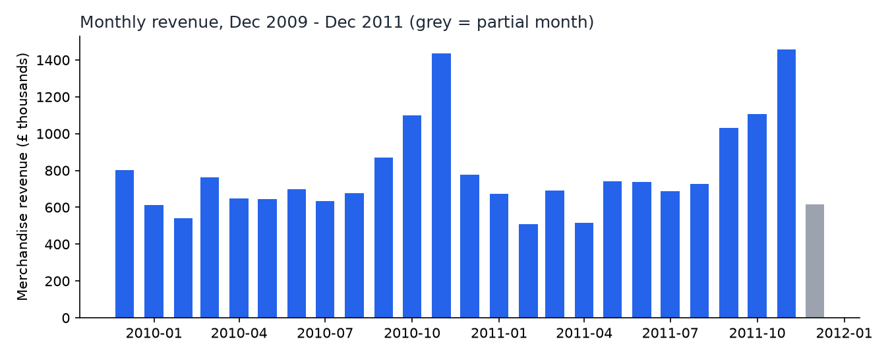

# Results, part 1 — run of 2026-09-22

Every number below comes from `retail-analytics analyze` on the checksum-verified workbook (SHA-256 `bcbe73b3…df2e980`). The CSVs are written to `outputs/`. Cohort, segmentation, concentration, and return-rate results arrive with part 2.

## 1. What the cleaning rules removed

Rules are applied in order, so each line is counted once, under the first rule that removes it.

| Rule | Lines | % of lines | Line value (£) |
|---|---:|---:|---:|
| Cancellation (invoice starts with `C`) | 19,165 | 1.83 | −1,465,303.66 |
| Non-merchandise code (postage, fees, adjustments, vouchers, DCGS channel) | 4,801 | 0.46 | 675,296.94 |
| Non-positive quantity | 3,362 | 0.32 | 0.00 |
| Non-positive price | 2,576 | 0.25 | 0.00 |
| **Kept as a sale** | **1,014,944** | **97.14** | **19,699,768.84** |

That is 1,044,848 lines after removing the 22,523-row sheet overlap.

**A choice I made and would defend:** exact duplicate lines *within* a sheet are kept. There are 11,731 of them, worth £57,093, which is **0.29%** of revenue. With no way to tell a double scan from two genuine identical lines on one invoice, deleting them would be a guess, and the amount is too small to change any conclusion.

**Anonymous sales** (no customer ID) stay in the revenue KPIs. They are 7–27% of monthly revenue, peaking in December 2010 at 27.1%. Part 2's customer-level analyses exclude them.

## 2. Monthly KPIs

Revenue peaks every November: £1.44M in 2010 and £1.46M in 2011, against a typical £0.6–0.8M. That fits a gift-ware seller's Christmas cycle. December 2011 is flagged partial because it has only 9 days of data. Its high average order value (£754) is based on those 9 days alone, so I would not read it as a trend.

## Known limits

- One retailer, and one country's customer base: 92% of sale lines are UK.
- Cancellations are not linked back to the sale they reverse, so a return counts in the month it was cancelled.
