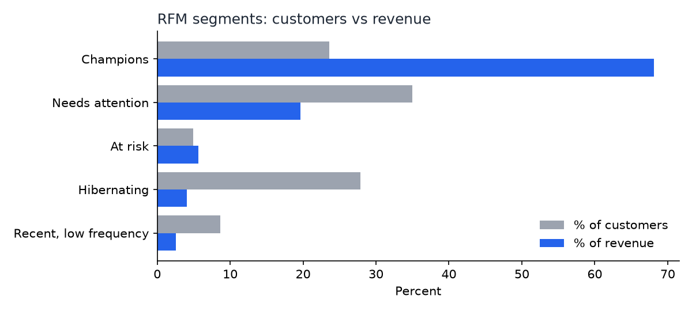

# Results — run of 2026-09-22

Every number below comes from `retail-analytics analyze` on the checksum-verified workbook (SHA-256 `bcbe73b3…df2e980`). The CSVs they come from are written to `outputs/`.

## 1. What the cleaning rules removed

Rules are applied in order, so each line is counted once, under the first rule that removes it.

| Rule | Lines | % of lines | Line value (£) |
|---|---:|---:|---:|
| Cancellation (invoice starts with `C`) | 19,165 | 1.83 | −1,465,303.66 |
| Non-merchandise code (postage, fees, adjustments, vouchers, DCGS channel) | 4,801 | 0.46 | 675,296.94 |
| Non-positive quantity | 3,362 | 0.32 | 0.00 |
| Non-positive price | 2,576 | 0.25 | 0.00 |
| **Kept as a sale** | **1,014,944** | **97.14** | **19,699,768.84** |

That is 1,044,848 lines after removing the 22,523-row sheet overlap.

**Choice I made and would defend:** exact duplicate lines *within* a sheet are kept. There are 11,731 of them, worth £57,093, which is **0.29%** of revenue. Without a way to tell a double scan from two genuine identical lines on one invoice, deleting them is a guess, and the number is too small to change any conclusion.

**Anonymous sales** (no customer ID) stay in revenue KPIs and are excluded from cohorts, RFM, and concentration. They are 7–27% of monthly revenue. The peak is December 2010 at 27.1%.

## 2. Monthly KPIs

Revenue peaks every November: £1.44M in 2010 and £1.46M in 2011, against a typical £0.6–0.8M. That fits a gift-ware seller's Christmas cycle. December 2011 is flagged partial because it has only 9 days of data. Its high average order value (£754) comes from those 9 days only, so I would not read it as a trend.

## 3. Cohort retention

"Retention at month *k*" means the share of a cohort that bought at least once in the *k*-th month after its first purchase. It is not "still a customer", because a customer can skip a month and come back.

| Offset | Weighted retention (first cohort excluded) |
|---|---:|
| Month 1 | 21.0% |
| Month 3 | 21.1% |
| Month 12 | 18.4% |
| First cohort (Dec 2009), month 1 | 35.0% |

What the heatmap shows:

- **Retention is flat, not decaying**, at about 20% from month 1 to month 12. The customers who come back keep coming back, and most of the loss happens right after the first purchase.
- **There is a seasonal echo, aligned to the calendar rather than the offset.** Every late-2010 cohort spikes when the calendar reaches the autumn 2011 buying season, whatever its offset. Sep 2010 reaches 22.6% at month 12 (Sep 2011), Oct 2010 reaches 23.2% at month 13 (Nov 2011), Nov 2010 reaches 25.2% at month 12 (Nov 2011), and Dec 2010 reaches 19.7% at month 11 (Nov 2011). The middle months for those cohorts sit around 8–13%.
- **The December 2010 cohort is the weakest** (month-1 retention 9%). This is the month with the highest anonymous-revenue share, and the cohort likely contains many one-off Christmas gift buyers. That is a hypothesis, not something I tested.

## 4. RFM segmentation

| Segment | Customers | Rule |
|---|---:|---|
| Needs attention | 2,045 | everything not below |
| Hibernating | 1,632 | R ≤ 2 and F ≤ 2 |
| Champions | 1,380 | R ≥ 4 and F ≥ 4 |
| Recent, low frequency | 506 | R ≥ 4 and F ≤ 2 |
| At risk | 289 | R ≤ 2 and F ≥ 4 |

Champions are 23.6% of customers and 68.2% of identified revenue. Hibernating customers are 27.9% of customers and 4.1% of revenue.

**Scoring choice:** scores use `percent_rank`, not `NTILE`. With `NTILE(5)`, a large block of one-order customers (all tied at frequency 1) would be split across several scores arbitrarily, so the same behaviour would get different labels depending on row order. `percent_rank` gives ties the same score, and there is a test that pins this.

## 5. Revenue concentration

| Top X% of customers | Customers | Share of identified revenue |
|---:|---:|---:|
| 1% | 59 | 32.01% |
| 5% | 293 | 51.89% |
| 10% | 586 | 63.81% |
| 20% | 1,171 | 77.10% |
| 50% | 2,926 | 93.51% |

At the 20% cut this is close to the familiar 80/20 (77.1%). The unusual part is the very top: 59 customers, 1% of the base, bring in almost a third of revenue. That is consistent with a customer base that includes wholesalers, and it means losing a handful of accounts would matter more than any retention percentage suggests.

## 6. Return rates

Returned merchandise value is **3.65%** of gross merchandise sales overall and 3.77% for the UK. Spain shows 13.24%, but that is almost entirely **one customer** (#12454, three cancellation invoices worth £12,361 of Spain's £12,955 returned). A country-level rate built on 3,572 sale lines is fragile, and I would not report it as a country effect.

## Known limits

- One retailer, one country's customer base (92% of sale lines are UK).
- Cancellations are not linked back to the sale they reverse, so a return counts in the month and country of the cancellation.
- Cancellations of sales made before 2009-12-01 are included in returned value, while the original sales are not.
